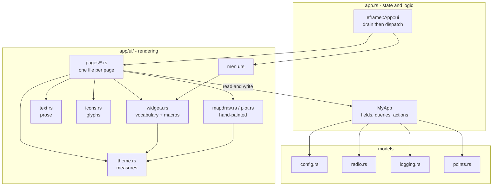

# UI architecture

How the GUI is put together, for anyone changing a page or adding a control.
The UI is [egui](https://docs.rs/egui) in immediate mode, driven each frame by
`eframe::App::ui`.

## Module layout

- `src/app.rs` - owns **state** and the per-frame update loop. `MyApp` holds
  every field the UI reads or writes; `eframe::App::ui` drains the input
  channels and then dispatches to one page renderer based on `self.page`. It
  also holds the queries and actions the pages call (`visible_points`,
  `recorded_points`, `discard_tracks`, `apply_sleep_interval`, ...), so a page
  asks a question or names an action rather than computing one inline.
- `src/app/ui/` - owns **rendering**. It is a submodule of `app`, so its
  `impl MyApp` blocks can reach `MyApp`'s private fields directly. It is split
  by *kind of thing*, so a change has one obvious home:
  - `pages/` - one file per page (`map`, `points`, `status`, `beacon`,
    `settings`, `radio`, `logging`, `manual`). Each is a list of declarations:
    this section, that control, bound to this field.
  - `widgets.rs` - the vocabulary those declarations are written in: the
    `content_page`/`floating` scaffolding, the small shared rows, and the
    macros (below).
  - `theme.rs` - every size and spacing in the app, as a named measure, plus
    the functions that turn one into points for the current screen.
  - `text.rs` - the long-form prose and the hover texts, one module per page.
  - `icons.rs` - the icon set, one function per glyph.
  - `menu.rs` - the menu page and the corner toggle that opens it.
  - `mapdraw.rs`, `plot.rs` - the two hand-painted pictures, kept out of the
    pages that frame them. `plot.rs` reaches nothing in `MyApp`: the page hands
    it rows and it hands back a picture.

The page renderers read state that lives outside the UI too: `src/config.rs`
holds the app's own TOML settings, `src/radio.rs` holds the board's RADIO.TOML
model the Radio page edits (and the airtime estimate the Radio page prints),
and `src/logging.rs` holds the CSV recorder behind the Logging page (all three
below).

The split is deliberate: `app.rs` reads as state + logic, the `ui` modules read
as "how each page is drawn". Add new state to `MyApp`; add new drawing to a
`ui` module.

## The frame loop

`MyApp::ui` (in `app.rs`) runs once per frame:

1. `drain_sources()` pulls every pending message off the channels (phone GPS,
   compass, BLE beacon events, and the offline zoom-probe result) and updates
   state. Nothing in the render path blocks on IO.
2. It reads the viewport rect (`screen`) and matches on `self.page` to call the
   one page renderer.
3. After the page, it draws the always-on overlays: the corner page toggle (on
   every page but the map), the download-progress readout, and - on desktop
   only - the manual position bar.

Because egui is immediate mode, there is no retained widget tree: each renderer
re-emits its whole page every frame from current state. To change what shows,
change state (usually a `MyApp` field) and let the next frame redraw.

## Layering with Areas and Order

The screen is composed from `egui::Area`s, not panels, so their clip rects can
overrun the screen (needed for the rotating map's overscan). Stacking is
controlled by `egui::Order`, lowest first:

- `Background` - the full-screen page content (the map, or a `content_page`).
- `Middle` - the region-select box-drag layer, so drags draw a box instead of
  panning the map, while the controls above stay clickable.
- `Foreground` - the controls bar, floating popups, the manual GPS bar.
- `Tooltip` - the floating corner page toggle on non-map pages.

Pointer priority follows the same order: a higher layer under the pointer wins
the click. This is why the controls sit in `Foreground` over an interactive
(`Background`) map.

## The widget vocabulary (`widgets.rs`)

A page file should read as *what is on the page*. Everything repeated between
pages is named once here, so the declarations are what is left.

The scaffolding, as functions:

- `content_page(ctx, id, screen, safe, add)` - a full-screen `Background` area
  filled with the panel color, a `page_margin` margin, with both safe-area
  insets already kept clear. The closure supplies the heading and body. Used by
  Points, Status, Beacon, Settings, Radio, Logging.

  The bottom inset is part of the frame's **inner margin**, not space added
  after the content, and that is the point of it: a `ScrollArea` sizes its
  viewport to the height it is given, so the inset has to come off that height
  to keep the last row of a scrolled page above the Android gesture bar.
  Trailing space inside the scroll would just scroll away with everything else.
  The fill still spans the whole screen, so the reserved strip is page-colored
  rather than a gap.

  It **pins the body's width** (`set_width`), and that is load-bearing rather
  than cosmetic. An `Area` sizes itself to whatever it held last frame, so its
  `Ui` has no width to wrap text against: a long label lays out as one endless
  line and widens the page instead of wrapping, and it never shrinks back.
  Pinning the width to the screen less the two margins is what makes the
  paragraphs on Status, Beacon and Settings wrap - and it also makes the frame
  exactly screen-wide.
- `floating(ctx, id, order, pos, pivot, constrain, add)` - a popup `Frame` in
  its own area, for the transient overlays (selection hint, download confirm
  and progress, marker info bubble, manual position bar).
  `confirm_popup(ctx, id, screen, add)` is the centered case of it.
- `row(ui, label, add)` - a wrapping row of controls behind a leading label.
  Wrapping rather than plain horizontal because these labels are sentences more
  often than words: a plain `horizontal` never wraps, so on a phone the last
  control is pushed off the edge instead of dropping to the next line.
- `text_field(ui, buf, hint, width)` and `submitted(ui, &resp)` - a single-line
  input, and whether Enter has just committed it, so a field and the button
  beside it act alike.
- `drag(ui, &mut value, speed, range)` - a number the user drags, over the
  range the loader will accept.
- `feedback_label` / `status_bool` - the small repeated result and status rows,
  each taking the `[ui]` colors to draw with. (`theme_color`, the
  checkbox-plus-picker row for a color that may be left to the theme, lives in
  `pages/settings.rs` beside its only user.)
- `icon_button` / `icon_button_pulse` - a square icon button. Icons are white
  SVGs tinted to the current text color, so they follow the light/dark theme.
  `icon_button_pulse` oscillates the background to flag an action with no
  target (the center button when there is no marker).

And the macros, for the declarations a function cannot express - the ones with
optional pieces, and the variadic one:

| Macro | Writes |
| --- | --- |
| `hint!(ui, TEXT)` | dimmed prose under a heading or a control. A string literal is treated as a `format!` pattern, so `hint!(ui, "{n} points")` fills in; `hint!(ui, small ..)` is the smaller version. |
| `heading!(ui, "Title"[, INTRO])` | the page title, and optionally a line saying what the page is for. No trailing gap - what follows decides its own leading space. |
| `section!(ui[, sep] "Title"[, HINT])` | the space that sets a group apart, its title, and optionally a line explaining it. `sep` rules a line above the title as well. |
| `button!(ui, "Label", enabled: c, hover: h, disabled: d)` | a text button; every piece after the label is optional but ordered. Evaluates to the `Response`, so a press is still `.clicked()`. |
| `check!(ui, place, "Label", hover: h)` | a checkbox bound straight to the field it sets. |
| `grid!(ui, "id", \|ui\| { "label" => control, .. })` | a two-column grid of label-and-control pairs, for the settings that really are a table. |

`hint!` is the reason a literal is always a pattern: the alternative silently
prints `{n}` when someone writes an inline capture. `button!` folds its optional
`enabled:` away as `true && cond`, so the arm costs nothing when it is absent.

The colors that carry meaning are not in `theme.rs`: `feedback_label`,
`status_bool` and `icon_button_pulse` take a `config::UiSettings` from the
`[ui]` table, so a theme reaches the pages and not just the map.

## Prose (`text.rs`)

Only the long form lives there: the paragraphs explaining a group of settings,
and the hover texts saying what a control actually does. Short labels ("Save",
"track", "Units:") stay next to the widget they name, where reading the page
tells you what the page says.

The split is by length rather than by principle. A button reading "Save" is
part of the layout; the three lines under it explaining what saving writes and
where are a piece of writing, and having them inline is what turns a page of
controls into a page of string literals with controls between them. Copy that
takes a value (`text::beacon::wake_check(min, max)`) is a function, `format!`
needing a literal pattern.

## Measures (`theme.rs`)

`ICON_SIZE_*`, `BUTTON_PAD_*_FRAC`, `TOGGLE_PAD_FRAC`, `CORNER_MARGIN_FRAC`,
`PAGE_MARGIN_FRAC`, `GAP_*` and `FIELD_*_EM` live there with the functions that
apply them, so a size is decided in one place and a page reads
`gap(ui, GAP_SECTION)` rather than a point count:

- `icon_size_for(screen)` - icon side length as a fraction of the smaller
  screen dimension, clamped, so the toolbar stays proportional on phone and
  desktop.
- `icon_size_for_row(screen, avail, spacing, count)` - the same size, but capped
  so `count` buttons still fit `avail` points: no button may exceed a `1/count`
  share of the width, counting its padding and the gaps between buttons. The
  controls bar counts its buttons before laying any out and sizes itself with
  this, so adding one shrinks the row instead of pushing it off the edge.
- `em`, `gap`, `page_margin`, `corner_margin`, `field_width`,
  `control_height` - the rest of the page measures.
- `apply_spacing(style)` - the insides of every control, off the body font with
  a touch-target floor (below).

## Sizing: nothing is a fixed pixel count

Every measure in the UI is a fraction of something that already scales, so a
page holds its proportions on a phone and on a desktop:

- **Fractions of the screen** for the layout frame - the icon size
  (`icon_size_for`), the page and controls-bar margins (`page_margin`,
  `controls_margin`), the corner inset (`CORNER_MARGIN_FRAC`), the marker hit
  radius, and the smallest drag that counts as a region box.
- **Fractions of the icon size** for anything sitting beside the toolbar: the
  button padding, the menu page's button sizes, and how far the floating panels
  hang below the bar.
- **Text units** (`em(ui)`, the body text height) for everything inside a page:
  the vertical rhythm (`gap(ui, GAP_*)`, five steps from `GAP_HAIR` to
  `GAP_SECTION`) and input widths (`field_width`, a fraction of the screen held
  between `FIELD_MIN_EM` and `FIELD_MAX_EM`). Spacing written this way follows
  the font rather than fighting it.

The one deliberate exception is `TOUCH_MIN` (and `ICON_SIZE_MAX`), which clamps
in absolute points: it is a touch target, and a fingertip is the same size
whatever the screen is. It is one number for the whole app - the floor under an
icon's side and under the height of every button, field, checkbox and dropdown.

### The insides of a control (`apply_spacing`)

Everything above is the space *between* controls. The space *inside* one is
egui's `Style::spacing`, and its stock values are absolute point counts:
`interact_size.y = 18`, `button_padding = (4, 1)`, `icon_width = 14`. Left
alone that gives two problems:

- A button is 18 points tall before padding - under half a fingertip, on an app
  whose every page is a page of buttons.
- `text_scale` scales the *font*. Padding, the checkbox glyph and the minimum
  control height are not fonts, so they stayed put: doubling the text size gave
  big letters in the same cramped rows, beside a checkbox that had not moved.

`theme::apply_spacing` rewrites that set off the body font size with `TOUCH_MIN`
as the floor, and `MyApp::apply_ui_style` calls it alongside the text styles it
is derived from - so it is re-applied exactly when `text_scale` changes. Being
on the style rather than per page, it reaches the dropdown popups, the color
pickers and the map's popups too.

Two things follow from it that are easy to miss when adding a page:

- A `TextEdit` is the one control egui sizes to its *text* rather than to
  `interact_size`, so `widgets::text_field` sets a vertical margin to bring it
  up to the height of the button beside it.
- `ui.selectable_label` is a `Button`, so it takes the same floor. The Points
  list must therefore tell `show_rows` that height (`control_height(ui)`) and
  not the text height, or the virtual scrolling places rows where they are not.

The controls bar opts out of the text-derived part on purpose: it sets its own
`button_padding` and `item_spacing.x` from the icon size. A toolbar spaced by
the page text would *shrink* when the text was enlarged, `icon_size_for_row`
dividing up what is left after the gaps.

Because the pages are measured in text units, one setting resizes them:
`[ui] text_scale` multiplies every entry of `Style::text_styles`, so `em(ui)`
grows and the gaps, the input widths and now the controls grow with it - larger
text is not larger glyphs in the same cramped rows. What it does not touch is anything measured off
the screen or the icon: the toolbar, the menu page's buttons (sized to the icon,
text included, so a scaled label would not fit them) and the map overlays, whose
sizes are `[sizes]` and are set separately.

## Pages and navigation

`Page` (in `app.rs`) is the enum of screens. `page_items()` in `menu.rs` lists
every page with its label and icon, in menu order, and drives the menu page.
`Page::Menu` is *not* in that list - it is the page doing the listing - and it
is reached only from the menu button. `MyApp::menu_from` remembers the page it
was opened from, which is both the entry marked as current and where leaving
without picking one goes.

- `menu_page` - the menu as a page of its own: one large button per entry,
  centered on an empty screen, measured in fractions of the icon size
  (the `ROW_*_FRAC` set in `menu.rs`) because the buttons are touch targets
  first. The column is
  centered vertically by hand - the page is an `Area`, which has no height to
  align against, so the free space is worked out from the screen instead.
- `page_menu` - the button that opens the menu page and closes it again. On the
  map it sits inline at the right end of the controls bar; the glyph crossfades
  between the hamburger and an X.
- `page_toggle` - a floating copy of that button in the top-right corner, drawn
  on every page *except* the map (the map uses the inline one); on the menu
  page it is the X that dismisses it. It pads its glyph with `TOGGLE_PAD_FRAC`,
  not the toolbar's `BUTTON_PAD_*_FRAC`: in the bar that padding doubles as the
  spacing between buttons and sits on the bar's own fill, while here it would
  draw a slab three times the glyph over the page text.

To add a page: add a `Page` variant, a `match` arm in `MyApp::ui`, a file under
`app/ui/pages/` with its renderer `impl MyApp` method (and a `mod` line in
`pages/mod.rs`), and an entry in `page_items()`.

## Safe-area insets

On Android the status bar and gesture bar overlap the window. `top_inset` and
`bottom_inset` (in `app.rs`) convert the platform-reported insets to egui
points, and `MyApp::safe_area` returns both together as a `SafeArea`. Both are
`0.0` on desktop, where there are no bars.

Pages take the `SafeArea` whole rather than the two ends separately, which is
how the bottom one came to be forgotten by every page that scrolls: the top
inset is visibly wrong the moment you look at the screen, and the bottom one
only hides the last row of a page you have to scroll to the end of.
`content_page` now keeps both clear, so a page gets it by being a page. The
overlays that sit at one edge still ask for the end they need - the manual
position bar and the download readout for the bottom, the corner page toggle
for the top.

## The map page (`pages/map.rs` + `mapdraw.rs`)

The map is a full-bleed `Background` area so it can overscan past the screen
edges. The key wrinkles:

- **Heading-up rotation.** When enabled and a heading is known, the map is
  drawn into a square `map_rect` sized to the screen diagonal (so the corners
  stay filled at any angle), then every painted shape is rotated about the
  screen center and clipped back to the screen. The drawn angle eases toward
  the live heading each frame (`smoothed_heading`) so it glides. On mobile,
  heading-up also locks the view centered on you (pan becomes a no-op).
  Heading-up is what runs the compass at full rate (see "The compass" below),
  and the button's visibility is keyed off `MyApp::has_direction` - "a heading
  exists *or* a compass could supply one" - rather than off a live reading.
- **The marker heading arrow.** Drawn by `GpsLayer` in every mode, from the same
  `effective_heading` the rotation uses, and eased on its own state
  (`smoothed_arrow`, a longer time constant than the map's) - outside heading-up
  the compass runs at a few Hz, so the raw readings would step it round in
  visible jumps. Both easings share `app::ease_heading`.
- **The center button.** A plain tap centers on you (falling back to the first
  beacon board with no fix yet); holding it - or right-clicking on desktop, both
  being `Response::secondary_clicked` - opens `center_menu_ui`, a list of every
  marker with a known position (`MyApp::center_targets`): you, the connected
  board, then each remote node under its config nickname (`MyApp::marker_label`).
  Either path goes through `MyApp::center_on`, which leaves tracking mode,
  centers (following the live position only for you), and kicks off the offline
  zoom probe.
- **Beacon heartbeat.** While the BLE link is up, a ring expands out of the
  beacon marker and fades, one beat per `PULSE_PERIOD`. The phase is computed in
  `MyApp::map` and handed to `GpsLayer` as `beacon_pulse`; the animation runs on
  `request_repaint_after(PULSE_FRAME)` rather than a per-frame repaint, so an
  otherwise idle map is not pinned at full frame rate.
- **Tracking mode.** The track button (`tracking_beacon: Option<MarkerKind>` is
  the board being followed - the board itself, not its place in
  `MyApp::beacon_targets`, which is ordered and grows in the middle, so an index
  would move to another board as soon as the connected board got a fix or a
  lower-numbered node was heard) frames the user and one beacon board
  together: `tracking_orientation` centers the view on their midpoint, picks a
  zoom that fits the pair inside the screen height less a top/bottom margin
  (`TRACK_MARGIN_FRAC`), and returns the user->board bearing that feeds the same
  rotation easing as heading-up - so the board rides near the top and the user
  near the bottom. It reuses `smoothed_heading` (tracking bearing and heading-up
  are mutually exclusive) and locks pan/zoom on every platform (the center and
  zoom are recomputed each frame). The track button is the only way in and out:
  tapping it enters the mode and **cycles through every beacon board** - the
  connected board first, then each remote node (`beacon_targets`, connected board
  then remotes in address order) - leaving the mode on the press after the last
  one (`MyApp::cycle_tracking`, with `next_tracking` deciding where a press
  goes and `tracking_hint` naming it). The heading button is hidden while
  tracking (which owns the map's orientation), as it is whenever no heading
  source is available at all.
- **Zoom is driven manually.** The map lives in a `Background` area, and
  walkers' built-in zoom only fires when the map is the top interactable layer
  under the pointer - which a background area never is. So walkers' zoom gesture
  is turned off (`zoom_gesture(false)`, `zoom_with_ctrl(false)`) and we drive
  zoom ourselves: mouse-wheel on desktop, pinch on Android (both gated by
  `cfg!(target_os = "android")`). The **+/- zoom buttons are desktop-only**;
  mobile relies on pinch, so the buttons would only crowd the small toolbar.
- **Panning** is by primary-button drag, suppressed while pinching or while a
  download box is being picked.
- **The path button** is a session-only master switch (`MyApp::show_paths`) over
  every recorded path. It only ever hides: which paths a shown map draws is
  `[track] show_path`, `[ble] show_path` and `[lora] show_path` on the Settings
  page (the phone track, the connected board's path, and the remote nodes' paths
  respectively), and the button changes none of them, so a press is undone by a
  press. The line to the tracked board and its distance label are not paths and
  stay drawn either way - they say where that board is *now*, which is what is
  worth keeping when the map is too busy to read. It replaced the old "clear
  tracks" button; discarding the points moved to the Settings page, off the bar
  used while moving.
- **Marker info.** A double-click/tap projects each marker to screen space (the
  same projection + rotation the marker layer draws with) and selects the
  closest one within a hit radius; a miss dismisses the popup.
- **Overlay drawing (`marker.rs`).** `GpsLayer` draws the phone track, the
  connected board and its path, every remote node (`RemoteDraw`: a marker and a
  dashed path each, in the node's palette color), and the line from the user to
  the distance target. It draws whatever it is handed and decides no visibility
  itself: a hidden path arrives as an empty `Vec`, so the map page is the only
  place the button and the per-path settings are combined. Remote colors are the
  built-in `config::remote_color(addr)` palette, cycled by LoRa address so a
  handful of nodes read apart; the connected board keeps the configurable
  `[colors] fixed`. Sizes come from `[sizes]` (each overlay independent). The
  distance line is dotted when `[distance] dotted` - both it and the distance
  label below are toggleable on the Settings page.
- **The distance target.** The user->board line and the distance label follow
  `MyApp::distance_target`: the board tracking mode currently has selected, or
  the connected board when not tracking. The line is drawn in that board's color
  (`fixed` for the connected board, its palette color for a remote), and
  `distance_to_target` measures to it.
- **The distance label** (`MyApp::distance_label`, units from `[distance]`, shown
  when `[distance] show`) is the one overlay NOT drawn by the plugin. Text needs
  an angle as well as a position, and leaving that to the rotation pass left the
  glyphs level, so the label is painted after the pass with both set outright: it
  projects the user and the distance target the same way the plugin does, turns
  the midpoint about the same pivot, and hands the map's angle to the text. It is
  painted as eight offset copies in the contrasting theme color (the outline)
  under the label itself, all sharing one laid-out galley.

## Offline region download flow

`RegionSelect` (in `app.rs`) is the state machine: `Inactive -> Picking ->
Confirm`.

- Started from the **Settings page** ("Offline maps" -> Download region), which
  sets `self.page = Page::Map` and `self.select = Picking`, jumping to the map
  with selection active. (It used to be a toolbar button on the map.) The
  section only appears when tiles are cached to disk (`cache_dir.is_some()`).
- `select_overlay` (Middle order) captures the drag and draws the box; on
  release it unprojects the box corners to lat/lon and moves to `Confirm`.
- `select_ui` (Foreground) shows the "drag a box" hint (with a Cancel button,
  since there is no longer a toolbar toggle to cancel) and then the confirm
  panel: a max-zoom stepper and the tile-count/size estimate, gated by
  `MAX_REGION_TILES`.
- Confirming calls `offline::spawn_download`; `download_ui` shows progress
  floating bottom-left on every page until dismissed.

The actual tiling/fetching lives in `src/offline.rs`; the UI only drives the
selection and shows progress.

## The Settings page (`pages/settings.rs` + `config.rs`)

The app's own TOML settings are edited here, not just loaded. Every widget binds
straight to the live `AppConfig` on `MyApp`, so a change shows on the map at
once; the file is only touched by the buttons.

**The split with the Beacon page is by who owns the setting**, not by subject.
Settings holds what the app owns and can save: the config file itself, the text
size of the pages, the marker colors and overlay sizes, what the map draws
(including the beacon path and the distance read-out), the compass rate behind
the marker arrow, track recording, and the offline-map download.
Everything the *board* owns, plus the link that reaches it, is on the Beacon
page below. The beacon-related app settings (`[ble] enabled`, `mac` and the
`[ble.names]` nicknames) live there anyway, because they decide how the link is
made and are useless apart from it; they repeat the Save button rather than
sending you back here for it, writing the same file and sharing the same
`config_feedback` line.

- **Save** (`MyApp::save_config` -> `AppConfig::save`) edits an existing file in
  place with `toml_edit`: comments, key order, and any keys the app knows nothing
  about survive, and only the values it owns are replaced (each keeps the decor
  of the value it replaced). With no file there, it generates a documented one
  from `AppConfig::to_toml`, which doubles as the "generate a config" action.
- **Reset to defaults** drops `AppConfig` back to its built-in defaults in memory
  only; the file is untouched until the next Save, so a Load undoes it.
- **The default path** (`default_config_path`) is the config file beside the tile
  cache, which on Android is the app's private data directory - the working
  directory there can be read but never written, so a bare filename could never
  be saved. On desktop the cache is relative, leaving the plain filename in the
  working directory. It is both what starts loaded and what Save writes back to.
- **Colors are in two tables.** `[colors]` is the map (`track`, `fixed`, and the
  `outline` ring around both dots); `[ui]` is the pages: `ok`, `error` and the
  `pulse` on a toolbar button with no target, where the color *is* the message,
  plus `background`, `button` and `text` - the surfaces and the text everything
  else is drawn with - and `text_scale`, how big that text is.
- **Those three are theme overrides, and empty means "don't".**
  `Option<Color32>`, written as `""` when unset so the key stays in the file.
  `MyApp::apply_ui_style` pushes them into the visuals before any page is
  drawn: it starts from `Theme::default_visuals` every time rather than editing
  what is there, so clearing an override (or switching theme) restores the theme
  without the app holding a copy of it. It runs only when the theme, one of the
  colors or the text scale moved - writing the style clones it, and the map
  repaints continuously.
- **Text size is the fourth key in `[ui]`.** `text_scale` (0.8 - 2.5, edited by
  the slider under "Text size") is applied by the same function, rebuilding
  `text_styles` from `egui::style::default_text_styles()` scaled - from the base
  sizes every time, so dragging the slider never compounds on the last scale.
  Both themes get it at once, the sizes being the same either way. The slider's
  own width is a fraction of the *screen*, the one input on the page not measured
  in text: it is the control whose text grows as it is dragged, and an em-based
  width would walk out from under the finger setting it.
- **One color, several states.** `button` fills `inactive`, `hovered`, `active`
  and `open`, the last three blended toward the text color: lighter than the
  button in a dark theme, darker in a light one, so one setting yields three
  states in either. `text` is written into every state's `fg_stroke` rather than
  into `override_text_color`, which only reaches plain labels - the stroke is
  what the toolbar glyphs (tinted with `text_color()`), the checkmarks and the
  button text all read. `strong` text takes the *active* state, which the theme
  keeps a step past the body, so it gets the same color shaded 0.35 toward white
  (dark theme) or black (light); weak text is alpha off the body color and
  follows by itself.
- The three are independent, so nothing stops a background and a text color that
  cannot be read against each other. The theme is what normally keeps them in
  step; the Settings page and the generated TOML both say that setting one is
  taking that on yourself.
- `[track] show_path`, `[ble] show_path` and `[lora] show_path` are the per-path
  overlay settings (the phone track, the connected board's path, and every remote
  node's path). The map bar's path button is a session-only master switch over
  all three (`MyApp::show_paths`) and never writes them, so the saved settings
  survive it. None affects recording: the points are kept either way, which is
  why discarding them is its own button under "Track recording" (it clears the
  phone, beacon and every remote track). `mac` is an `Option<String>` where
  `None` means "any board"; it is no longer typed by hand but chosen in the
  Beacon page's device picker.
- **Remote LoRa nodes** are relayed to the app by the connected board over the
  `midair_proto::ble::REMOTE_UUID` characteristic (`[src, rssi, PositionPacket]`);
  the transports decode it with `ble::remote_event` into `BleEvent::Remote`, and
  `drain_sources` buckets them by `src` into `MyApp::remotes` (a `RemoteNode` per
  address: live position, last packet, RSSI, and its own track). The board keeps
  only one remote slot and re-notifies it each interval, so the drain treats only
  a changed packet as a new report. Each node's nickname lives in `[lora.names]`
  (keyed by address; "Node N" when unset) and is resolved through
  `MyApp::marker_label`, so every page names a node the same way. Switching the
  connected board (`forget_board_state`) drops the live remote positions but
  keeps their tracks, the same bargain the connected board's own path strikes.

## The Beacon page (`pages/beacon.rs` + `ble/`)

Everything about the beacon that is not drawing: which board to talk to
(`device_picker_ui`), the link to it (`ble_link_ui`), the connection settings,
the notify interval, and the board's own power and sleep settings.

### Choosing a board (`device_picker_ui`)

Several boards can be in range at once - typically when they are together to be
configured or woken, rather than tracked. **Only one is ever connected**, so the
picker is a single-choice list and the transports keep their single-session
shape.

- **Identity is the MAC, the readable name is the app's.** Every board runs the
  same firmware and so advertises the same `packet::DEVICE_NAME`, which makes a
  raw scan a list of identical entries. `[ble.names]` maps MAC -> nickname in
  the app's config; the board is never told its name. `normalize_mac` is what
  makes the key stable - addresses come back in whatever case the stack prefers
  and a hand-edited file may use dashes, so the raw string would file one board
  twice.
- **Discovery is its own worker mode, not the connect scan.** `BleCommand::Scan`
  reports every board that answers as a `BleEvent::Discovered` and keeps going;
  the scan inside a connect stops at the first match. `BleIntent::Scanning` maps
  to it and drops any live link, since a connected session does not scan.
- **The list is what is on the air plus what has a name.** `device_rows()` unions
  the nicknames with the current scan's sightings, and always includes the pinned
  MAC so the selected board is never invisible. Sightings age out after
  `SEEN_TIMEOUT`, so a board that stops advertising reads as "not answering"
  rather than silently keeping its last signal reading.
- **Nicknames commit on blur, not per keystroke.** An empty name forgets the
  board, so committing on every keystroke would delete the row the moment the box
  was cleared to retype. `name_edits` holds the buffers separately from
  `config.ble.names` for the same reason.
- **Switching boards drops the last one's state** (`forget_board_state`). The
  position, packet, telemetry, log and settings all describe the old board; a
  stale beacon position is the worst of them, since the map would go on drawing
  it as the board now selected. `beacon_track` is deliberately kept - it is
  recorded history that also backs the Points page.

### Board power and sleep (`board_power_ui`)

The bottom section of the Beacon page drives the Wio-S3's own sleep switches
and deep sleep. Unlike everything above it, **none of it is app state**: the
board holds these in flash and is the authority on them.

There is no GPS/LoRa power rail here, and the app deliberately offers no
control for one. The protocol still carries `CFG_PWR_EN` and the board still
stores the flag, but the wio-s3-max-gps board has no switch behind it - the
GPS and the SD sit directly on +3V3 - so a checkbox would move, ack, and
change nothing. A respin that brings the switch back brings the control back
with it.

- **The board tells us, we do not tell the board.** The worker reads
  `ble::SETTINGS_UUID` on connect and subscribes to it; each blob decodes into
  `BleEvent::Settings` and lands in `MyApp::board_settings`. Every checkbox
  binds to a copy of that blob, so a click sends a write and the checkbox only
  moves once the board reports it moved. This matters because the board changes
  these by itself: it clamps an out-of-range interval.
- **One write in flight.** `MyApp::send_config` sets `ble_ack_pending`, which
  disables the controls until the ack arrives. The text inputs are seeded from
  the first settings blob of a session only, so a later notification cannot
  overwrite something half-typed.
- **A newer firmware is said out loud.** `Settings::decode` returning `None` is
  a layout-version mismatch, which becomes `BleEvent::SettingsUnsupported` and
  hides the controls behind an explanation - never a fall back to defaults the
  board never reported.
- **One sleep control, and it never disarms itself.** The board has a single
  wake-check interval (`CFG_ESP_SLEEP_S`), clamped to 5 s - 5 min. Connecting
  does not clear it, so the app needs no memory of what the board is doing:
  auto-connect is simply `config.ble.enabled`, and `sync_ble_to_config` has no
  special case. The 5 min ceiling is what makes that safe - deep sleep has no
  wake source but the timer, so the ceiling is the longest the board can be out
  of reach, and a wait that long needs no confirmation, no persisted state and
  no way back in beyond waiting.
- **The advertising window has no Disable, unlike the interval next to it.**
  `CFG_ESP_ADV_WINDOW_S` sets how long each wake advertises, clamped to
  `ble::ESP_ADV_MIN_S` - `ESP_ADV_MAX_S` (1 s - 60 s; the page reads the
  constants rather than quoting numbers). The wake-check interval takes 0 to
  mean "never sleep", which is
  the safe direction; a 0-length window is the opposite, leaving a sleeping
  board unreachable by anything but a physical reset, so the board clamps 0 up
  to the floor and the page offers no button that asks for it. The two controls
  sit together because they are the same decision - the interval and the window
  are the duty cycle, and so the battery life - but only one of them can be
  turned off.
- **Every acked number is quoted back.** `ack_message` names the setting and
  the value the board stored, because the clamping is otherwise invisible: ask
  for a window under the floor and the only sign it was changed is the ack. The
  advertising window had no arm at all and acked as the literal "Board applied:
  setting", which read as a write that did nothing in particular.
- **Two window behaviors are said out loud on the page.** The board takes its
  budget when a wake starts (`session::Window::new`), so a new window applies
  at the *next* wake; and a disconnect replaces what is left of the budget with
  `session::LINGER_S` so the app can come straight back. Both read as the board
  ignoring the setting, the more so the shorter the window, so the page says
  them rather than leaving them to be discovered.
- **Text that quotes a board value reads it from the board.** The window used
  to be a fixed 15 s and several strings said so; now that it is configurable
  only the strings shown while connected quote `adv_window_s`, and the ones
  shown while trying to connect describe the window without a number, because
  at that point the app has no live value to quote.
- **Every press is forceful, and the epoch is what makes it so.** `MyApp`
  numbers its requests (`ble_epoch`, `ble::Epoch`); the number goes out on the
  `BleRequest` and comes back on every `BleUpdate`. The worker compares what it
  is being asked for now against the `ble::Target` its session started with
  (`Wanted::interrupt`) at every step that could stop, so a press ends the
  running session rather than being noticed once it finishes; the UI drops
  events older than its current epoch, so the tail of that session cannot land
  on the pages as if it described the new board. Epoch 0 is the worker speaking
  before any request reached it (no adapter, no Bluetooth) and is never fenced.
  This is what fixes "Disconnect, then connect to a different board, and it
  connects to the first one anyway": the session was reading its target once
  and the waits inside it serviced no commands at all.
- **Set-intent resets, it does not request a reset.** `set_ble_intent` drops
  `ble_connected`, `connected_at`, `board_heard` and everything in
  `forget_board_state` on the press, without waiting for the worker to confirm.
  Waiting would leave the pages showing a board the user has already let go of.
  It is also why Connect stays enabled while connected: pressing it is a real
  request (start over from a scan), and the only way out of a link that is up
  but has stopped working. The button reads "Reconnect" then.
- **Steps that block still service commands.** Desktop wraps its long GATT
  calls in `while_wanted` (drops the operation the moment the session is
  superseded); Android's `wait_cb` polls its callback channel and the command
  channel together, and `ensure_permissions` gives up if the UI stops asking
  while the dialog is up. Both transports then tear the link down
  unconditionally on the way out, because a connect walked away from can still
  land.
- **Queued config writes belong to a board, not to the app.** `Inbox::drain`
  throws them away on a Disconnect, a scan, or a change of MAC; only a repeat
  connect to the same board keeps them.
- **The link is three explicit buttons, not a toggle** (`ble_link_ui`,
  `MyApp::ble_intent`). Connect / Connect to sleeping / Disconnect map one to
  one onto `BleIntent::{Connect, ConnectSleeping, Idle}`, and each button sends
  exactly one `BleCommand`. Disconnect is not a nicety: the board only
  deep-sleeps while nothing is connected, so an app that reconnects on its own
  keeps it awake and its sleep interval never does anything. There was no way
  to express "leave it alone" while connecting was a checkbox the app
  re-applied itself.
- **Buttons must never compose commands.** `drain_commands` empties the whole
  channel in one pass, so a Disconnect queued just before a Connect is
  overwritten and never happens. `set_ble_intent` therefore sends a single
  command per press, and there is no "reconnect" that is secretly two.
- **Intent is session state, not config.** `[ble] enabled` seeds it at startup
  and is never written back, so a Disconnect lasts until the next launch rather
  than quietly becoming a saved preference. The checkbox is labelled for what
  it actually is: connect automatically at startup.
- **Intent survives a connect.** It says what to do when there is *no* link, so
  a board that goes back to sleep is still chased if that is what was asked
  for. Only Disconnect clears it.
- **Two status lines, and they say different things.** `ble_intent_text()` is
  what the app was asked to do; `ble_status` is the worker's running commentary
  on the attempt. Showing only the second was most of why "nothing seems to
  happen" - a scan that is working looks identical to one that is not.
- **"Connected" is only claimed while the board is talking.** Both platforms
  can hold a dead link open for a long time, so `MyApp::board_silence` watches
  when anything last came off a characteristic (`board_heard`); after three
  notify intervals of quiet (10 s floor) the intent line switches to
  "Connected, but nothing from the board for X." and loses the all-well color.
  The "for X" counts (here and in "Connecting for X") restart per attempt: on
  every request sent and on the moment a live link drops.
- **`chase` is what makes the two transports behave the same.** Desktop always
  finds its device by scanning, so chasing only changes its status line. The
  Android worker normally shortcuts a pinned MAC straight to `connectGatt`,
  which is a *bounded* attempt - retried on a fixed cycle it can stay out of
  phase with a 15 s window for a very long time. Chasing makes it scan and
  match the address among the hits instead, exactly as desktop does, so it is
  always listening. The shortcut stays for the normal case, where a continuous
  low-latency scan would cost battery for nothing.

## The Radio config page (`pages/radio.rs` + `radio.rs`)

The Radio page loads the board's `RADIO.TOML` (the firmware's own config, not the
app's) and edits it in place. The model lives in `src/radio.rs`; the page in
`radio_page`.

- **Model (`radio.rs`).** `RadioDoc` wraps a `toml_edit::DocumentMut` (the source
  of truth for values) plus an ordered `Vec<RadioField>` of the editable
  settings. `toml_edit` is used precisely so a load/edit/save round-trip keeps
  the file's comments and its `<key>_description` help strings; only the edited
  value's text changes (its surrounding whitespace/decor is preserved).
- **Types.** Each field renders with an input matched to its type
  (`FieldType`): a `DragValue` for int/float, a checkbox for bool, a text field
  for a string, and a dropdown for an `Enum`. The type is inferred from the TOML
  value, but a sibling `<key>_type` string overrides it -
  `"int"`/`"float"`/`"bool"`/`"string"`, or `"enum:a,b,c"` for a dropdown. The
  `<key>_description` and `<key>_type` keys are treated as metadata and never
  shown as their own rows.
- **Per-field edit lock.** State is `RadioEdit` (in `app.rs`): `None ->
  Confirm -> Active`. A field is read-only with a pencil button; pressing it
  opens the floating Edit/Cancel confirm popup (`radio_confirm_popup`);
  confirming unlocks the typed input with a check (set, writes the value into the
  document via `RadioDoc::apply`) and an x (cancel). Only one field is in flight
  at a time - the other pencils are disabled while editing.
- **Generating a default.** With nothing loaded, "Generate default config"
  (`MyApp::default_radio` -> `RadioDoc::default_at`) fills the editor from the
  firmware's own `RADIO.example.toml`, `include_str!`d from the sibling
  esp32c6-gps checkout this crate already builds against - so there is no second
  copy of the schema to keep in step. It starts dirty and writes nothing until
  Save, which backs up any existing file first.
- **Backups.** `Save` copies the previous on-disk file into a `radio-backups`
  directory next to it, under a timestamped name, before overwriting. The
  collapsible "Backups" list shows them newest-first; "Restore" loads one back
  into the editor (unsaved until the next Save). The document tracks a `dirty`
  flag, surfaced as `Save *`.

## The Logging page (`pages/logging.rs` + `plot.rs` + `logging.rs` + `export.rs`)

A CSV of everything that arrives, a graph over it, and a way to get the file
off the device. The model is `src/logging.rs`; the page is `logging_page`.

- **A row is a report, not a tick.** `MyApp::record` is called from
  `apply_gps_fix` and from the `Fix` / `Remote` / `NodePing` / `Telemetry` arms
  of `drain_sources`, so a row is written whenever a source *says something*.
  That is what keeps a node's position and the signal it was heard at on the
  same row, which is the pairing the whole feature exists for - a periodic
  sample would have to guess which RSSI went with which fix. It also means the
  log is denser than the tracks: a fix is logged whether or not it is far
  enough from the last one to become a track point (`[track] min_distance`
  decimates a drawn path, not a record).
- **Columns a row has nothing to say about stay empty.** Every measurement on
  `LogRow` is an `Option`, and an unset one writes as an empty cell. A
  spreadsheet reads that as "no reading"; a zero would be a reading, and
  `0 dBm` and `0 m` are both plausible ones.
- **The derived columns are filled in one place.** `MyApp::record` adds where
  the control device was, the distance from it to whatever reported, and the
  distance from that to the fixed reference. The call sites only supply what
  the report itself carried. `dist_user_m` is deliberately left empty on our
  own fixes: the distance from the device to itself is zero, and a zero there
  would plot as a source that had arrived.
- **The reference point** (`[log] ref_lat`/`ref_lon`) is a fixed coordinate
  every logged position is *also* measured against, so a range test can be read
  against a surveyed point rather than against a control device that is moving
  too. Both halves or neither - a lone latitude is a typo and fails the load
  rather than silently leaving an always-empty column. It has no empty form the
  way the theme colors and the pinned MAC do (`""` is not a float), so
  clearing it removes the keys, which is what `set_opt` in `config.rs` is for.
- **The file is appended to, never truncated.** Stopping and starting again
  continues the same log; losing a run to a mis-tap is worse than a file with
  two sessions in it. The header is written only when the file is new or empty.
  Every row is flushed as it is written - a phone can drop the app at any
  moment, and a buffered tail would take the most recent part of the run.
- **The file is the record, the rows in memory are the view.** `Logger` keeps
  `MAX_ROWS` for the graph and drops the oldest past that (the page says how
  many, so a shortened plot never quietly misrepresents the run). An export
  therefore prefers reading the file back and falls back to memory only when
  there is no file.
- **The graph is painted by hand** (`MyApp::plot`), not by a plotting crate:
  the job is a handful of autoscaled series in the config's own colors at a
  size measured off the screen, and a crate would arrive with its own sizing,
  theming and gestures to fight. The Y axis is a `LogStat`; the X axis is a
  `LogAxis` - time, or another stat. Against time a series is a **line** (the
  rows are in order, and the gaps are part of the story); against another stat
  it is a **scatter** (the order means nothing, so joining the points would
  draw a shape that is not in the data). Distance-vs-RSSI is the second kind.
- **A point needs both axes on the same row**, which is what makes the scatter
  honest: telemetry rows carry an RSSI but no position, so they contribute
  nothing to a distance plot rather than a column of points at zero range.
- **The legend is the filter.** What is drawn and what it is drawn in are the
  same question, so the legend entries are toggles (`MyApp::log_hidden`,
  session state). Every source ever seen keeps its entry, hidden or not -
  otherwise there is no way to bring one back. Colors are `LogSource::color`,
  which is the map's: your color, the board's, and `remote_color(addr)`.
- **Export is the one thing that is platform-shaped.** `MyApp::export` is an
  `Option<export::Saver>` - the same shape as `insets`, so `app.rs` stays free
  of `cfg`. On Android it is `export::downloads_saver`, which inserts the CSV
  into `MediaStore.Downloads` over JNI so it lands in the phone's Downloads
  folder; the app's own data directory, where the log is written, is
  unreachable from the phone itself. MediaStore is used rather than a plain
  write because it needs **no storage permission at all** on API 29+. It is
  also all framework classes, so unlike the BLE and location bridges it needs
  no Java shim or dex rebuild. On desktop it is `None` and the page writes a
  timestamped copy beside the log itself, the path there already being one the
  user typed.
- **The log path is not a setting until it is saved.** With `[log] file` unset
  the page starts on a timestamped name beside the config; "Save settings" is
  what makes the current one stick, since writing a generated name back would
  pin every later run to the same file. The path input is disabled while
  recording - the open file is what it names.

## Manual position bar (desktop)

With no live GPS source (`gps_rx.is_none()`, i.e. desktop), a bottom-anchored
bar lets a position be typed as "lat, lon". A valid entry feeds the same
`apply_gps_fix` pipeline a real fix would and recenters the map. It is shown on
the Map page only.

## The compass (mobile)

`src/compass.rs` reads the NDK rotation-vector sensor on its own thread. The
handle the app holds (`CompassHandle`) is three parts: the heading channel, a
`wanted` flag, and an `interval_us` rate, both of the latter set by the UI.

The rotation vector is fused from the accelerometer, gyroscope and magnetometer,
so running it keeps all three awake - **the rate is what a heading costs in
battery**, and it is set to what is actually being drawn:

- **Heading-up** turns the whole map, and gets the full `HEADING_UP_HZ` rate.
- **North-up and tracking** only point the marker's heading arrow, so they run
  the sensor at `compass.arrow_hz` from the config (default 4 Hz) - and only on
  the map page, where that arrow is drawn. Clearing `compass.marker_arrow` in
  the config turns this off entirely, leaving the arrow on GPS course over
  ground, which is how it behaved before the setting existed.

`MyApp::sync_compass_power` runs once per frame in `MyApp::ui`, pushes both the
flag and the rate, and clears `compass_heading` on the way down so a reading that
has stopped updating is not left on screen. The sensor thread polls the flag
between event reads, enables/disables accordingly (dropping any events queued
across a disable), and applies a rate change to the running sensor - so moving
between heading-up and the arrow rate does not interrupt the readings. Every
requested interval is floored at `ASensor_getMinDelay`, since asking for faster
than the hardware delivers is an error.

The struct is compiled on every target (the app holds an `Option<CompassHandle>`
everywhere); only `compass::spawn` and the thread are Android-only.

## Platform differences at a glance

Mobile vs desktop is gated on `cfg!(target_os = "android")` and on whether the
live-source channels/insets are present:

- **Zoom**: desktop = wheel + buttons; mobile = pinch (no buttons).
- **GPS**: mobile = live GNSS channel; desktop = manual position bar.
- **Heading-up lock**: mobile locks/centers the view; desktop keeps free pan.
- **Compass**: mobile only, and powered only while heading-up is on.
- **Marker list**: opened by a long press on mobile, a right-click on desktop.
- **Insets**: non-zero on mobile, zero on desktop.
- **Log export**: mobile copies into Downloads through MediaStore; desktop
  writes the copy beside the log itself.
